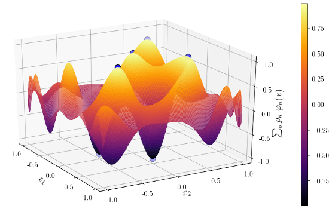

# Solving the BLASSO using Lasserre hierarchies

  

This repository allows to solve the Beurling LASSO with polynomial measurements
using Lasserre hierarchies such as decribed in [1]. The `example.ipynb` notebook allows to reproduce the experiments presented in this paper.

## Installation instructions

Enter `add https://github.com/rpetit/BLASSOLasserre.jl` in the Pkg REPL

## References

[1] Y. De Castro, F. Gamboa, D. Henrion, J.-B. Lasserre, exact solutions to super-resolution on semi-algebraic domains in higher dimensions, IEEE Transactions on Information Theory, 2017
